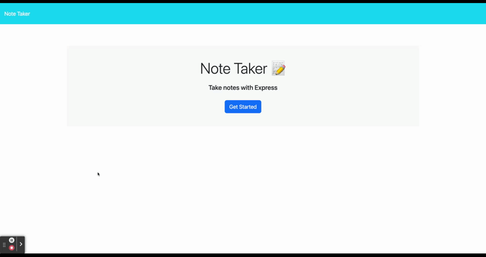

  # Express.js Note Taker 

  
  ## Table of Contents 
  - [Description](#description)
  - [Installation](#installation)
  - [Usage](#usage)
  - [Contributions](#contributions)
  - [Tests](#test)
  - [License](#license)
  - [Questions](#questions)
  

## Description

This project is a web interface that allows you to keep track of notes. Once added, the notes will be stored in the server for future reference. Notes can also be deleted as necessary. Stored notes will load with the page and added/deleted notes will update with the appropriate interactions.

## Installation

The application runs online, so the user should not need to install any dependencies.

## Usage

The application has a landing page that the user will first encounter. Once the "Get Started" button is pressed, the user will be directed to the note taker's interactive section. 

Here is a demo:

## Contributions

Thank you to classmates Eric Kirberger and Azime Nail, tutor Dru Sanchez, and TAs Paul Cwik and Justyn Subrai for their guidance with this project. 

## Tests

N/A

## License
N/A
    

## Questions
See more of my work [here!](https://github.com/sam-lerner) 

I can be reached via e-mail at sam.a.lerner@gmail.com. Thank you for reading!

